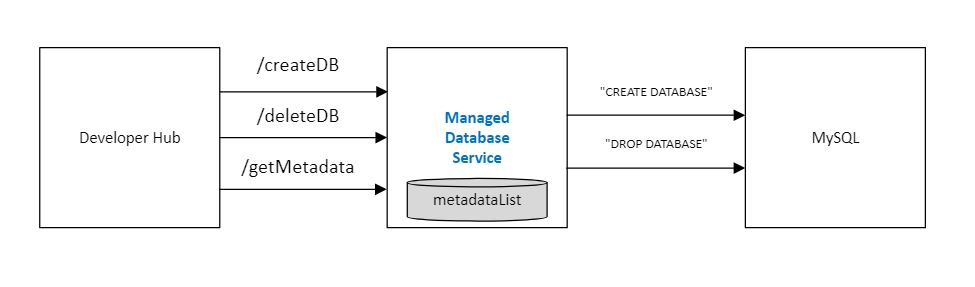
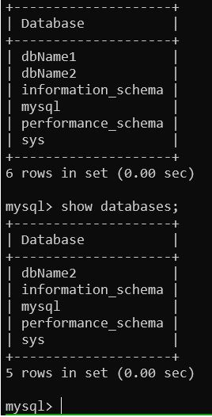

# Managed Database Service

## Problem Statement

<div style="text-align: justify"> Your team is responsible for providing the organization with a managed database service. This service integrates with a Developer Hub where developers manage their applications and their dependencies. The team responsible for the Hub requires your service to conform to an API so users of the Hub can spin databases up and bring them down. You are tasked to collaborate with the Hub team and codesign a good API model for the problem. </div>

## Block diagram 



## Pre-requisites 

* go version go1.22.2
* `curl` to make web requests
* mysql version 8.0 on Ubuntu 20.04

## Setting Up the Project

First, make the projects directory and navigate to it:

```bash
$ mkdir dbserver
$ cd dbserver
```

## Listening for Requests and Serving Responses

A Go HTTP DB server includes two major components: 

1. The server that listens for requests coming from HTTP clients and 
2. one or more request handlers that will respond to those requests. 

<div style="text-align: justify"> We'll be using the function http.HandleFunc to tell the server which function to call to handle a request to the server. Then, we’ll use the http.ListenAndServe function to start the server and tell it to listen for new HTTP requests and then serve them using the handler functions that is set up. </div></br>

```go
import (
	"encoding/json"
	"errors"
	"fmt"
	"io"
	"net/http"
	"os"
	"strings"
)

func createDB(w http.ResponseWriter, req *http.Request) {
	log.Printf("got /createDB request\n")
    ...
}

func deleteDB(w http.ResponseWriter, r *http.Request) {
	log.Printf("got /deleteDB request\n")
    ...
}

func getMetadata(w http.ResponseWriter, r *http.Request) {
	log.Printf("got /getMetadata request\n")
    ...
}

func main() {
	http.HandleFunc("/createDB", createDB)
	http.HandleFunc("/deleteDB", deleteDB)
	http.HandleFunc("/getMetadata", getMetadata)

	err := http.ListenAndServe(":3333", nil)
    ...
}
```

By not specifying an IP address before the colon, the server will listen on every IP address associated with the computer, and it will listen on port 3333.

## Create DB: Connecting to MySQL and Creating a Database

### Importing the MySQL driver

The first step in creating the MySQL database is to download the MySQL driver package and import it into the application. After having created the directory (dbserver), let’s initialize a go module for the project. The next step is to download the MySql driver. Run the following command to download the MySQL driver package.

```bash
$ go mod init 
$ go get github.com/go-sql-driver/mysql
```

Let’s update the program to import the MySQL driver we just downloaded.

```go
import (
	"database/sql"
	_ "github.com/go-sql-driver/mysql"
)
```

### Connecting and Creating the Database

Let’s define constants for the DB credentials. We must never define passwords in plain text for security reasons but for the sake of this program, we will define them in plain text.

```go
const (
	username = "root"
	password = "password"
	hostname = "127.0.0.1:3306"
)
```

The DB can be opened by using Open function of the sql package. This function takes two parameters, the driver name, and the data source name(DSN). </br>
Let’s write a small function that will return us this DSN when the database name is passed as a parameter.

```go
func dsn(dbName string) string {
	return fmt.Sprintf("%s:%s@tcp(%s)/%s", username, password, hostname, dbName)
}
```

For example, if 'dbName' is passed, it will return root:password@tcp(127.0.0.1:3306)/dbName. </br>
The dbName is optional and it can be empty. Since we are actually creating the DB here and do not want to connect an existing DB, an empty dbName will be passed to the dsn function.

```go
func createDB(w http.ResponseWriter, req *http.Request) {
	log.Printf("got /createDB request\n")

    ...
	// an empty dbName will be passed to the dsn function.
	// open and return a connection to the database
	db, err := sql.Open(t.Engine, dsn(""))
	if err != nil {
		log.Printf("Error %s when opening DB\n", err)
		return
	}
    ...
}
```

After establishing a connection to the DB, the next step is to create the DB. The following code does that.

```go
	ctx, cancelfunc := context.WithTimeout(context.Background(), 5*time.Second)
	defer cancelfunc()

	res, err := db.ExecContext(ctx, "CREATE DATABASE IF NOT EXISTS "+t.Name)
	if err != nil {
		log.Printf("Error %s when creating DB\n", err)
		return
	}
	no, err := res.RowsAffected()
	if err != nil {
		log.Printf("Error %s when fetching rows", err)
		return
	}
	log.Printf("rows affected: %d\n", no)
```

After opening the database, we use the ExecContext method to create the database. 

* We pass a context with a timeout of 5 seconds to ensure that the program doesn’t get stuck when creating the DB in case there is any network error or any other error in the DB. </br>
* cancelfunc is only needed when we want to cancel the context before it times out. There is no use of it here, hence we just defer the cancelfunc call.

The ExecContext call returns a result type and an error. We can check the number of rows affected by the query by calling the RowsAffected() method. The above code creates a database named `dbName`.

### Understanding Connection Pool

* When we first executed sql.Open("mysql", dsn("")), the DB returned is actually a pool of underlying DB connections. 
* The sql package takes care of maintaining the pool, creating and freeing connections automatically. 
* This DB is also safe to be concurrently accessed by multiple Goroutines. 

We close the existing connection to the mysql which we created without specifying a DB name and open a new connection with the DB name `dbName` which was just created.

```go
	db.Close()

	db, err = sql.Open(t.Engine, dsn(t.Name))
	if err != nil {
		log.Printf("Error %s when opening DB", err)
		return
	}
	defer db.Close()
```

### Connection Pool Options

There are few important connection pool options to be set to ensure that network partitions and other runtime errors that may occur with our DB connections are handled properly.

* SetMaxOpenConns: This option is used to set the maximum number of open connections that are allowed from our application. 
* SetMaxIdleConns: This option limits the maximum idle connections.
* SetConnMaxLifetime: This option ensures that the driver closes the idle connection properly before it is terminated by a firewall or middleware.

```go
	db.SetMaxOpenConns(20)
	db.SetMaxIdleConns(20)
	db.SetConnMaxLifetime(time.Minute * 5)
```

### Pinging the DB

* The Open function call doesn’t make an actual connection to the DB. It just validates whether the DSN is correct.
* The PingContext() method must be called to verify the actual connection to the database. It pings the DB and verifies the connection.

```go
	ctx, cancelfunc = context.WithTimeout(context.Background(), 5*time.Second)
	defer cancelfunc()
	err = db.PingContext(ctx)
	if err != nil {
		log.Printf("Errors %s pinging DB", err)
		return
	}
	log.Printf("Connected to DB %s successfully\n", t.Name)
```

We create a context with a 5 second timeout to ensure that the program doesn’t get stuck when pinging the DB in case there is a network error or any other error.

### Return Databse UUID as Response

* We are using generate UUID_SHORT() to get an ID. 
* This ID is sent as HTTP Response 

```go
	// get uuid for the DB created
	uuid := 0
	queryGetUUID := db.QueryRow(`SELECT UUID_SHORT()`)
	err = queryGetUUID.Scan(
		&uuid,
	)
	if err != nil {
		log.Printf("Errors %s getting UUID", err)
		return
	}
	log.Printf("UUID %d\n", uuid)

	var d response
	d.uuid = fmt.Sprintf("%v", uuid)
	w.Header().Set("Content-Type", "application/json")
	io.WriteString(w, "UUID of DB created: ")
	json.NewEncoder(w).Encode(d.uuid)
```

## Delete DB

We use the ExecContext method to delete the database. 

* We pass a context with a timeout of 5 seconds to ensure that the program doesn’t get stuck when deleting the DB in case there is any network error or any other error in the DB. </br>
* cancelfunc is only needed when we want to cancel the context before it times out. There is no use of it here, hence we just defer the cancelfunc call.

The ExecContext call returns a result type and an error. We can check the number of rows affected by the query by calling the RowsAffected() method. The above code deletes a database named `dbName`.

```go
	db, err := sql.Open("mysql", dsn(dbName))
	if err != nil {
		log.Printf("Error %s when opening DB", err)
		return
	}
	defer db.Close()

	ctx, cancelfunc := context.WithTimeout(context.Background(), 5*time.Second)
	defer cancelfunc()

	res, err := db.ExecContext(ctx, "DROP DATABASE "+dbName)
	if err != nil {
		log.Println(err)
		return
	}

	rowCount, err := res.RowsAffected()
	if err != nil {
		log.Println(err)
		return
	}
	log.Printf("rows affected: %d\n", rowCount)
```

## Get Metadata

Let’s define request, response structs and thereby define the metadata to be maintained by the DB Server.
Note: For the sake of this program, metadata is maintained in memory.

```go
type payload struct {
	Name     string
	Engine   string
	Size     string
	Replicas int64
}

type response struct {
	uuid string
}

type metaData struct {
	Name     string
	Engine   string
	Size     string
	Replicas int64
	uuid     string
}

// metadata for list of DBs
var metaDataList = []metaData{}
```

Below function checks if DB is present in the metadata list.

```go
func findRecordsByDBName(name string) int {
	for p, v := range metaDataList {
		// check equal under Unicode case-folding
		if strings.EqualFold(v.Name, name) {
			return p
		}
	}
	return -1
}
```

When creating a DB, we create an entry to the metadata list.

```go
func createDB(w http.ResponseWriter, req *http.Request) {
	log.Printf("got /createDB request\n")

	decoder := json.NewDecoder(req.Body)
	var t payload
	err := decoder.Decode(&t)
	if err != nil {
		panic(err)
	}

	if findRecordsByDBName(t.Name) != -1 {
		fmt.Println("DB is present" + t.Name)
		return
	}

    ...

    // update metadata
	m := metaData{t.Name, t.Engine, t.Size, t.Replicas, d.uuid}
	metaDataList = append(metaDataList, m)
	log.Println(metaDataList)
```

When deleting a DB, we delete the entry from the metadata list.

```go
func deleteDB(w http.ResponseWriter, r *http.Request) {
	log.Printf("got /deleteDB request\n")

	dbName := r.URL.Query().Get("dbName")
	log.Println("dbName =>", dbName)

	p := findRecordsByDBName(dbName)
	if p == -1 {
		log.Println("DB is not present" + dbName)
		return
	}
	log.Printf("DB is present at pos: %v", p)

    ...

	// update metadata
	metaDataList = append(metaDataList[:p], metaDataList[p+1:]...)
	log.Println(metaDataList)

```

Below function prints the metadata list.

```go
func getMetadata(w http.ResponseWriter, r *http.Request) {
	log.Printf("got /getMetadata request\n")
	log.Println(metaDataList)
}
```


## Error Handling and Async Operations

* We pass a context with a timeout of 5 seconds to ensure that the program doesn’t get stuck when creating/deleting the DB in case there is any network error or any other error in the DB. 
* cancelfunc is only needed when we want to cancel the context before it times out. There is no use of it here, hence we just defer the cancelfunc call.
* We close the existing connection to the mysql which we created without specifying a DB name and open a new connection with the DB name `dbName` which was just created.


## Program Execution

The full code is provided below.

```go
package main

import (
	"encoding/json"
	"errors"
	"fmt"
	"io"
	"net/http"
	"os"
	"strings"

	"context"
	"database/sql"
	"log"
	"time"

	_ "github.com/go-sql-driver/mysql"
)

// We must never define passwords in plain text for security reasons but for
// the sake of this program, we will define them in plain text.
const (
	username = "root"
	password = "password"
	hostname = "127.0.0.1:3306"
)

type payload struct {
	Name     string
	Engine   string
	Size     string
	Replicas int64
}

type response struct {
	uuid string
}

type metaData struct {
	Name     string
	Engine   string
	Size     string
	Replicas int64
	uuid     string
}

// metadata for list of DBs
var metaDataList = []metaData{}

func dsn(dbName string) string {
	return fmt.Sprintf("%s:%s@tcp(%s)/%s", username, password, hostname, dbName)
}

func findRecordsByDBName(name string) int {
	for p, v := range metaDataList {
		// check equal under Unicode case-folding
		if strings.EqualFold(v.Name, name) {
			return p
		}
	}
	return -1
}

func createDB(w http.ResponseWriter, req *http.Request) {
	log.Printf("got /createDB request\n")

	decoder := json.NewDecoder(req.Body)
	var t payload
	err := decoder.Decode(&t)
	if err != nil {
		panic(err)
	}

	if findRecordsByDBName(t.Name) != -1 {
		fmt.Println("DB is present" + t.Name)
		return
	}

	// an empty dbName will be passed to the dsn function.
	// open and return a connection to the database
	db, err := sql.Open(t.Engine, dsn(""))
	if err != nil {
		log.Printf("Error %s when opening DB\n", err)
		return
	}

	// After establishing a connection to DB, next step is to create DB.
	ctx, cancelfunc := context.WithTimeout(context.Background(), 5*time.Second)

	// cancelfunc is only needed to cancel the context before it times out.
	// There is no use of it here, hence we just defer the cancelfunc call.
	defer cancelfunc()

	// Being a responsible developer, we pass a context with a timeout of
	// 5 seconds to ensure that program doesn’t get stuck when creating DB
	// in case there is any network error or any other error in the DB
	res, err := db.ExecContext(ctx, "CREATE DATABASE IF NOT EXISTS "+t.Name)
	if err != nil {
		log.Printf("Error %s when creating DB\n", err)
		return
	}
	no, err := res.RowsAffected()
	if err != nil {
		log.Printf("Error %s when fetching rows", err)
		return
	}
	log.Printf("rows affected: %d\n", no)
	db.Close()

	// In the above line, we close the existing connection and open a new
	// connection to the DB. This time we specify the DB name when opening a
	// connection to the database.
	db, err = sql.Open(t.Engine, dsn(t.Name))
	if err != nil {
		log.Printf("Error %s when opening DB", err)
		return
	}
	defer db.Close()

	// There are few important connection pool options to be set to ensure that
	// network partitions and other runtime errors that may occur with our DB
	// connections are handled properly.

	db.SetMaxOpenConns(20)
	db.SetMaxIdleConns(20)
	db.SetConnMaxLifetime(time.Minute * 5)

	ctx, cancelfunc = context.WithTimeout(context.Background(), 5*time.Second)
	defer cancelfunc()
	err = db.PingContext(ctx)
	if err != nil {
		log.Printf("Errors %s pinging DB", err)
		return
	}
	log.Printf("Connected to DB %s successfully\n", t.Name)

	// get uuid for the DB created
	uuid := 0
	queryGetUUID := db.QueryRow(`SELECT UUID_SHORT()`)
	err = queryGetUUID.Scan(
		&uuid,
	)
	if err != nil {
		log.Printf("Errors %s getting UUID", err)
		return
	}
	log.Printf("UUID %d\n", uuid)

	var d response
	d.uuid = fmt.Sprintf("%v", uuid)
	w.Header().Set("Content-Type", "application/json")
	io.WriteString(w, "UUID of DB created: ")
	json.NewEncoder(w).Encode(d.uuid)

	// update metadata
	m := metaData{t.Name, t.Engine, t.Size, t.Replicas, d.uuid}
	metaDataList = append(metaDataList, m)
	log.Println(metaDataList)
}

func deleteDB(w http.ResponseWriter, r *http.Request) {
	log.Printf("got /deleteDB request\n")

	dbName := r.URL.Query().Get("dbName")
	log.Println("dbName =>", dbName)

	p := findRecordsByDBName(dbName)
	if p == -1 {
		log.Println("DB is not present" + dbName)
		return
	}
	log.Printf("DB is present at pos: %v", p)

	db, err := sql.Open("mysql", dsn(dbName))
	if err != nil {
		log.Printf("Error %s when opening DB", err)
		return
	}
	defer db.Close()

	ctx, cancelfunc := context.WithTimeout(context.Background(), 5*time.Second)
	defer cancelfunc()

	res, err := db.ExecContext(ctx, "DROP DATABASE "+dbName)
	if err != nil {
		log.Println(err)
		return
	}

	rowCount, err := res.RowsAffected()
	if err != nil {
		log.Println(err)
		return
	}
	log.Printf("rows affected: %d\n", rowCount)

	// update metadata
	metaDataList = append(metaDataList[:p], metaDataList[p+1:]...)
	log.Println(metaDataList)
}

func getMetadata(w http.ResponseWriter, r *http.Request) {
	log.Printf("got /getMetadata request\n")
	log.Println(metaDataList)
}

func main() {
	http.HandleFunc("/createDB", createDB)
	http.HandleFunc("/deleteDB", deleteDB)
	http.HandleFunc("/getMetadata", getMetadata)

	err := http.ListenAndServe(":3333", nil)

	if errors.Is(err, http.ErrServerClosed) {
		log.Printf("server closed\n")
	} else if err != nil {
		log.Printf("error starting server: %s\n", err)
		os.Exit(1)
	}
}

```

Now that the code is ready, save the main.go file and run the program using go run. 
Unlike other Go programs, this program won’t exit right away on its own. Once you run the program, continue to the next commands:

```bash
$ go run main.go
```

Since the  program is still running in the  terminal, we will need to open a second terminal to interact with your server. 
In this second terminal, use the curl program to make an HTTP request to the  HTTP DB server. 

```bash
// createDB
$ curl -X POST -d "{\"name\": \"dbName1\", \"engine\": \"mysql\", \"size\": \"20MB\", \"Replicas\": 2}" http://localhost:3333/createDB
$ curl -X POST -d "{\"name\": \"dbName2\", \"engine\": \"mysql\", \"size\": \"30MB\", \"Replicas\": 3}" http://localhost:3333/createDB

// get metadata
$ curl http://localhost:3333/getMetadata

// deleteDB
$ curl http://localhost:3333/deleteDB?dbName=dbName1
$ curl http://localhost:3333/deleteDB?dbName=dbName2

```

The output will look like this in the first terminal where the HTTP DB server is running:

```bash
2024/07/24 22:45:16 got /createDB request
2024/07/24 22:45:16 rows affected: 1
2024/07/24 22:45:16 Connected to DB dbName1 successfully
2024/07/24 22:45:16 UUID 100934786117271616
2024/07/24 22:45:16 [{dbName1 mysql 20MB 2 100934786117271616}]
2024/07/24 22:47:26 got /createDB request
2024/07/24 22:47:26 rows affected: 1
2024/07/24 22:47:26 Connected to DB dbName2 successfully
2024/07/24 22:47:26 UUID 100934786117271617
2024/07/24 22:47:26 [{dbName1 mysql 20MB 2 100934786117271616} {dbName2 mysql 30MB 3 100934786117271617}]
2024/07/24 22:47:32 got /getMetadata request
2024/07/24 22:47:32 [{dbName1 mysql 20MB 2 100934786117271616} {dbName2 mysql 30MB 3 100934786117271617}]
2024/07/24 22:48:25 got /deleteDB request
2024/07/24 22:48:25 dbName => dbName1
2024/07/24 22:48:25 DB is present at pos: 0
2024/07/24 22:48:25 rows affected: 0
2024/07/24 22:48:25 [{dbName2 mysql 30MB 3 100934786117271617}]
2024/07/24 22:49:50 got /deleteDB request
2024/07/24 22:49:50 dbName => dbName2
2024/07/24 22:49:50 DB is present at pos: 0
2024/07/24 22:49:50 rows affected: 0
2024/07/24 22:49:50 []
```

* Since the server will continue running until the program finishes running, we’ll need to stop it ourself. 
* To do this, press CONTROL+C to send your program the interrupt signal to stop it.

MySQL DB snapshot:



## Further Enhancements

* metadataList can be stored on persistent storage.
* ORM, Viper can be used for clean design architecture.

## References

* https://www.digitalocean.com/community/tutorials/how-to-make-an-http-server-in-go 
* https://www.digitalocean.com/community/tutorials/how-to-install-mysql-on-ubuntu-20-04
* https://golangbot.com/connect-create-db-mysql/

### Commands for installing mysql

```bash
  $ sudo apt update
  $ apt list --upgradable
  $ sudo apt install mysql-server
  $ sudo systemctl start mysql.service
  $ sudo systemctl status mysql.service
  $ sudo mysql
  $ mysql -u root -p
  $ sudo mysql_secure_installation
  $ mysql -u root -p
```
